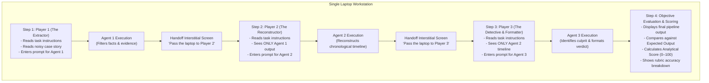

# 📋 Prompt Relay: Event Vision & Complete Flow

## 🌟 The Core Vision
**Prompt Relay** is a sequential prompt-engineering challenge where teams of 3 test their precision by chaining together three AI agents to solve a murder mystery.

The challenge is hosted on a **single laptop** at an event station. There is **no stage, no crowd, and no spectator jumbotron**. A team of 3 participants approaches the station together. They take turns sitting at the laptop, each managing one link in the AI pipeline. 

Each participant must read their specific task instructions, review the input provided to their agent, and write an effective prompt. The handoff between teammates is strictly isolated: later participants only see the output of the preceding agent—never the original story or previous players' prompts.

---

## 💻 The Station Setup
* **Hardware:** A single laptop workstation running the Prompt Relay web application.
* **Team:** 3 participants per team.
* **Timing:** The event organizers manage timing physically (e.g., using a stopwatch or clock). The web application itself is untimed and has no automatic countdown timers or auto-submit logic, allowing participants to read and compose their prompts without app-enforced cutoffs.

---

## 👥 The 3-Agent Relay Pipeline

Each team member is responsible for one agent in the sequence:

### 1. Player 1: Evidence Extraction
* **Their Task:** Review the assigned goal and read the unformatted, noisy "Case File" containing clues, dialogue, red herrings, and trivia.
* **Their Action:** Write a prompt directing **Agent 1 (Extractor)** to filter out noise and capture essential facts, suspects, and clues without prematurely drawing conclusions or hallucinating.
* **Execution:** Player 1 clicks "Submit". Agent 1 processes the story.
* **Handoff:** The screen transitions to an interstitial handoff screen (*"Player 1 Complete. Please hand the laptop to Player 2"*).

### 2. Player 2: Timeline Reconstruction
* **Their Task:** Review their specific instructions to build a chronological sequence of events.
* **Their Input:** **ONLY the output produced by Agent 1**. (Player 2 does not see the original raw case story or Player 1's prompt).
* **Their Action:** Write a prompt directing **Agent 2 (Reconstructor)** to construct a coherent, ordered timeline from the clues while avoiding premature verdicts.
* **Execution:** Player 2 clicks "Submit". Agent 2 processes the evidence.
* **Handoff:** The screen transitions to the next handoff screen (*"Player 2 Complete. Please hand the laptop to Player 3"*).

### 3. Player 3: Verdict & Formatting
* **Their Task:** Review the final goal—deduce the killer and structure the response.
* **Their Input:** **ONLY the timeline produced by Agent 2**. (Player 3 cannot see the original story or previous prompts).
* **Their Action:** Write a prompt directing **Agent 3 (Final Detective)** to deduce the true culprit, determine the weapon/method, identify the key clue, and format the output according to the required schema (e.g., JSON).
* **Execution:** Player 3 clicks "Submit". Agent 3 generates the final verdict.

---

## 📊 Step 4: Analytical Scoring & Evaluation

Once Player 3's agent completes its run:
1. **Output Display:** The screen presents the pipeline's final verdict to the whole team.
2. **Comparison with Expected Output:** The application compares the final output against the case's predefined ground truth / expected output.
3. **Objective Rubric Score (0–100):**
   * **Culprit Identification (40 pts):** Did the pipeline correctly deduce the true killer?
   * **Method / Weapon Deduction (25 pts):** Was the accurate murder method identified?
   * **Key Clue Attribution (20 pts):** Was the definitive smoking gun clue cited?
   * **Format & Schema Compliance (15 pts):** Did the output conform cleanly to the requested structure (e.g., valid JSON)?
4. **Accuracy Breakdown:** Clear, itemized feedback showing exactly where points were gained or lost, allowing the team to reflect on which agent's prompt was the strongest or weakest link.
5. **Session Summary:** Saves the team's score, prompts, and match transcript for tournament record keeping.

---

## 🤝 Developer Guidelines

1. **Focused Single-Laptop UI:** The entire user journey is contained within a clean, distraction-free wizard interface. Ensure clear visual separation between steps and clean interstitial handoff screens.
2. **Strict Information Hiding:** Do not leak earlier inputs or the original case story into the DOM or UI of later steps. Player 2 only receives Agent 1's output; Player 3 only receives Agent 2's output.
3. **No In-App Timers:** Timing is managed physically by event staff. Keep the interface free of timers, countdown clocks, or auto-submit logic.
4. **Analytical Evaluation:** The evaluation system uses structured semantic matching against ground truth to produce transparent, fair, and reproducible scores.
5. **Model & Provider:** Default to Google Gemini (`gemini-3.5-flash-lite`) via `langchain-google-genai` for fast, accurate generation.