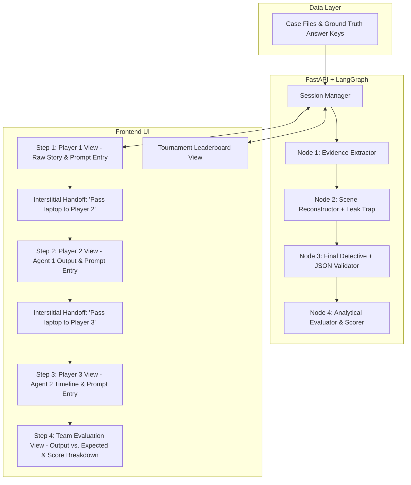

# 🗺️ Prompt Relay: Implementation & Development Roadmap

This document outlines the updated, focused phased development roadmap for **Prompt Relay: The Murder Mystery Challenge**. Designed specifically for a **single laptop station** where teams of 3 take turns prompting chained AI agents, with timing managed physically by event organizers and final results scored against an expected output.

---

## 🧭 System Architecture & Relay Pipeline



---

## 📌 Phase Summary Matrix

| Phase | Focus Area | Status | Primary Deliverable |
| :--- | :--- | :--- | :--- |
| **Phase 1** | Foundation & Environment | ✅ **Complete** | Python 3.12 environment, dependencies, `.env` config, health API |
| **Phase 2** | Mystery Content Engine | ✅ **Complete** | Pydantic case schema, 3 rich murder mysteries, `CaseLoader` & leak check |
| **Phase 3** | LangGraph Pipeline & Evaluator | 🔄 **Next** | Multi-agent state graph, guardrails, and analytical scoring node (0–100) |
| **Phase 4** | Backend API & Session Engine | ⏳ Pending | Session management, sequential step endpoints, evaluation persistence |
| **Phase 5** | Single-Laptop Station UI | ⏳ Pending | Wizard web interface with strict info hiding and handoff screens |
| **Phase 6** | Leaderboard, Persistence & Hardening | ⏳ Pending | SQLite match storage, tournament leaderboard, prompt resilience tests |

---

## 🚀 Phase 1: Project Scaffolding & Environment Setup
*Status: Completed*
- Configured dependencies in `pyproject.toml` (`fastapi`, `uvicorn`, `langgraph`, `langchain-google-genai`, `pydantic-settings`).
- Built modular directory layout (`backend/app/api`, `backend/app/core`, `backend/app/graph`, `backend/app/models`, `backend/app/services`, `backend/cases`, `data`, `frontend`, `tests`).
- Implemented typed settings with Google Gemini (`gemini-3.5-flash-lite`) as default provider.
- Created `GET /api/health` with automated unit tests.

---

## 📂 Phase 2: Mystery Content & Case File Engine
*Status: Completed*
- Designed `CaseModel` and `GroundTruth` Pydantic models.
- Authored 3 murder mystery case files:
  1. `case_01_blackwood_manor.json` (Victorian Manor / Cyanide Sugar)
  2. `case_02_neon_nexus.json` (Silicon Valley AI Startup / Bluetooth Insulin Bolus)
  3. `case_03_velvet_vault.json` (Gala Heist / Vitrine Neurotoxin)
- Implemented `CaseLoader` with `load_all_cases()`, `get_case()`, `get_random_case()`, and `check_leak()`.
- Verified with unit tests in `tests/test_cases.py`.

---

## 🧠 Phase 3: LangGraph Pipeline & Analytical Evaluator

### 🎯 Objective
Implement the 4-agent LangGraph workflow: three human-directed generation nodes and one automated evaluation node that computes an objective accuracy score (0–100) by comparing the final verdict against expected ground truth.

### 📋 Tasks
- [ ] **Define `GameState` Schema:**
  ```python
  class GameState(TypedDict):
      session_id: str
      team_name: str
      case_id: str
      case_file: str                # Raw story (Player 1 only)
      ground_truth: Dict[str, Any]  # Target solution
      user_1_prompt: str            # Player 1's instructions
      agent_1_output: str           # Extracted evidence
      user_2_prompt: str            # Player 2's instructions
      agent_2_output: str           # Reconstructed timeline
      user_3_prompt: str            # Player 3's instructions
      final_verdict: Dict[str, Any] # Parsed verdict {culprit, method, clue}
      leak_detected: bool           # True if Player 2 prematurely leaked killer
      leak_keywords_found: List[str]
      evaluation: Dict[str, Any]    # Score, rubric breakdown, diff vs expected
  ```
- [ ] **Node 1: Evidence Extractor (`agent_1_extractor`):**
  - Wraps User 1's prompt in system instructions prohibiting premature solving and limiting output strictly to extracted facts.
- [ ] **Node 2: Scene Reconstructor (`agent_2_reconstructor`):**
  - Synthesizes a chronological sequence from Agent 1's facts.
  - Automatically runs `check_leak` to flag if the culprit was leaked early.
- [ ] **Node 3: Final Detective (`agent_3_detective`):**
  - Evaluates the reconstructed timeline to deduce the killer.
  - Robust JSON extraction ensuring `{culprit, method, clue}` format even if markdown fences are present.
- [ ] **Node 4: Objective Analytical Evaluator (`agent_evaluator`):**
  - Compares `final_verdict` against `ground_truth` using structured semantic evaluation:
    - **Culprit accuracy (40 pts):** Correct murderer identified.
    - **Method accuracy (25 pts):** Correct murder weapon/technique identified.
    - **Key Clue accuracy (20 pts):** Proper smoking gun evidence cited.
    - **Format compliance (15 pts):** Clean JSON adherence.
    - *Penalty:* 20-point deduction if premature leak occurred in Step 2.
  - Outputs detailed comparison: Expected vs. Actual for each rubric criterion.
- [ ] Write automated tests validating full pipeline execution with Google Gemini (`gemini-3.5-flash-lite`).

### ✅ Acceptance Criteria
- End-to-end execution generates accurate results and scores in under 5–10 seconds.
- Evaluator produces reproducible numerical scores and itemized rubric breakdowns.

---

## ⚡ Phase 4: Backend API & Session Engine

### 🎯 Objective
Expose the pipeline through clean RESTful wizard endpoints and manage active team sessions without requiring client-side timers.

### 📋 Tasks
- [ ] **In-Memory Session Store:**
  - Manages active matches by `session_id`, storing current step and state history.
- [ ] **Endpoints Implementation:**
  - `POST /api/game/start`: Initializes session for `team_name`, selects case, returns `session_id` and raw story.
  - `POST /api/game/step1`: Executes Node 1 with Player 1's prompt; returns `agent_1_output`.
  - `POST /api/game/step2`: Executes Node 2 with Player 2's prompt; checks for leaks; returns `agent_2_output`.
  - `POST /api/game/step3`: Executes Node 3 (Detective) and Node 4 (Evaluator); returns `final_verdict`, `score` (0–100), and `evaluation` breakdown.
  - `GET /api/game/session/{session_id}`: Fetches current session status and outputs.
- [ ] Integration tests verifying valid step progression and prevention of out-of-order execution.

### ✅ Acceptance Criteria
- Endpoints enforce sequential step flow (Step 1 ➔ Step 2 ➔ Step 3).
- Step 3 returns the full evaluation diff against expected output.

---

## 💻 Phase 5: Single-Laptop Station UI (Player Wizard)

### 🎯 Objective
Build a focused, single-laptop web interface with strict step isolation, clear task briefings, and interstitial handoff screens.

### 📋 Tasks
- [ ] Implement UI flow (e.g. Next.js / React or Streamlit):
  - **Screen 1 (Team Welcome):** Enter team name, view overview of the rules, click "Start Challenge".
  - **Screen 2 (Player 1 - Evidence Extractor):**
    - Displays task prompt: *"Extract essential clues and filter noise."*
    - Displays full case story.
    - Prompt input textarea and "Run Agent 1" submit button.
  - **Interstitial Handoff 1:**
    - Full-screen modal: *"Step 1 Complete! Please hand the laptop to Player 2."*
    - "I am Player 2 - Ready" button to unlock next view.
  - **Screen 3 (Player 2 - Timeline Reconstructor):**
    - Displays task prompt: *"Build a chronological timeline from the evidence. Do NOT name the killer."*
    - Displays **ONLY Agent 1's output** (no case story, no Player 1 prompt).
    - Prompt input textarea and "Run Agent 2" submit button.
  - **Interstitial Handoff 2:**
    - Full-screen modal: *"Step 2 Complete! Please hand the laptop to Player 3."*
    - "I am Player 3 - Ready" button to unlock next view.
  - **Screen 4 (Player 3 - Final Detective):**
    - Displays task prompt: *"Name the culprit, method, and key clue. Output JSON."*
    - Displays **ONLY Agent 2's timeline**.
    - Prompt input textarea and "Submit Final Verdict" button.
  - **Screen 5 (Team Evaluation & Score Reveal):**
    - Displays pipeline's final verdict side-by-side with Expected Output.
    - Large overall score card (0–100).
    - Rubric breakdown cards: Culprit (+40), Method (+25), Key Clue (+20), Format (+15).
    - "View Leaderboard" or "New Team" button.

### ✅ Acceptance Criteria
- Strict information hiding: later players have no access to earlier case text or teammates' prompts.
- Clean, responsive laptop layout that requires zero technical guidance from event staff.

---

## 🏆 Phase 6: Leaderboard, Match Persistence & Hardening

### 🎯 Objective
Persist match results to SQLite, display an event leaderboard, and harden the system against edge cases.

### 📋 Tasks
- [ ] **SQLite Match Persistence:**
  - Save completed matches: Team Name, Case ID, Final Score, Rubric Breakdown, Full Transcripts, Timestamp.
- [ ] **Leaderboard View (`/leaderboard`):**
  - Displays ranked team standings sorted by total score (0–100) and tie-broken by date.
- [ ] **Adversarial & Edge Case Hardening:**
  - Graceful handling of empty prompts or non-English input.
  - Resilient JSON parsing for malformed LLM outputs.
  - Network error retries for Gemini API calls.

### ✅ Acceptance Criteria
- All match results are reliably stored in SQLite and reflected on the leaderboard.
- The system handles unexpected LLM responses without crashing or locking the UI.
